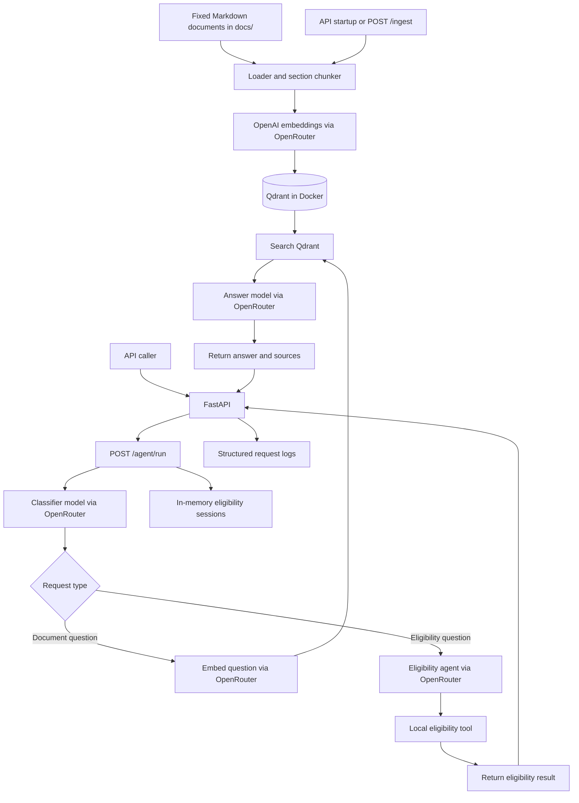
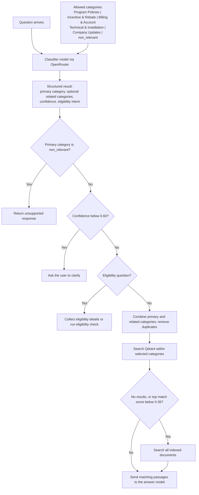
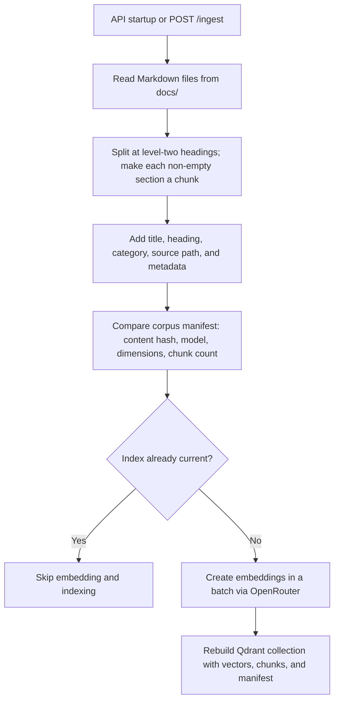

# SunGrid Cooperative Copilot

A small question-answering service and terminal chat that use the fixed SunGrid documents and check rooftop rebate eligibility.

Stack: Python 3.11, PydanticAI/Pydantic, OpenRouter embeddings and LLMs, and Docker Qdrant.

## Run locally

Prerequisites: Python 3.11, [uv](https://docs.astral.sh/uv/), and Docker Desktop.

1. From the repository root, install the app and test dependencies: `uv sync --extra dev`.
2. Create a `.env` file in the repository root and set `OPENROUTER_API_KEY`, `CLASSIFIER_MODEL_ID`, and `ANSWER_MODEL_ID`. `EMBEDDING_MODEL` defaults to `openai/text-embedding-3-small`; `AGENT_MAX_STEPS` defaults to `4`. The application reads `.env` directly.
3. Start Qdrant: `docker compose up -d qdrant`.
4. Choose a demo:
   - Terminal chat: `uv run python -m sungrid.terminal`
   - API service: `uv run uvicorn sungrid.api:app --reload`

Both demos index the fixed `docs/` folder when they start and reuse the index while it is current. In the terminal chat, type `quit` or `exit` to stop. Run the tests with `uv run pytest`.

## Assumptions

The knowledge base is a fixed set of Markdown files; each non-empty `##` section is one chunk, and document category mappings are maintained in code. The ambiguous rebate-adjustment document is tagged for both incentive and billing searches. Eligibility session state is kept in API process memory and is temporary.

## API

Open `http://localhost:8000/docs` to try the API.

- `POST /ingest` indexes the fixed `docs/` folder and returns the chunk count.
- `POST /agent/run` accepts `{"question": "When is my bill due?"}` and returns an answer with sources. Send the returned `chat_state` in the next request to continue a multi-turn eligibility check. It contains an opaque session ID; pending eligibility facts stay in process memory and are cleared when the check finishes. Restarting the API expires pending sessions.

## Architecture diagrams

### Overall architecture

This overview shows document indexing and how the API handles document questions and rebate eligibility checks.

### Query classifier and routing

The classifier labels each question as **Program Policies**, **Incentive & Rebate**, **Billing & Account**, **Technical & Installation**, **Company Updates**, or **non-relevant**; it can also include related categories for questions spanning topics. Eligibility intent is a separate flag. These labels determine document-search filters or the eligibility flow, while low confidence prompts clarification.

### Document ingestion pipeline

The service turns each non-empty Markdown section under a `##` heading into a searchable Qdrant chunk.

## Document categories

The rebate refund and billing adjustment notice is primarily **Incentive & Rebate Programs** and is also tagged **Billing & Account**, so either category search can find it.

The assessment's Part C design write-up is in [PART_C_DESIGN.md](PART_C_DESIGN.md).
